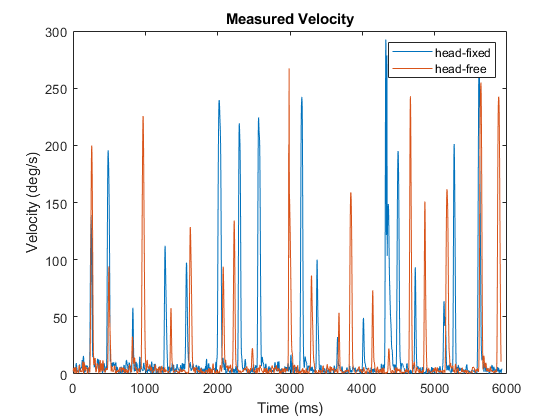
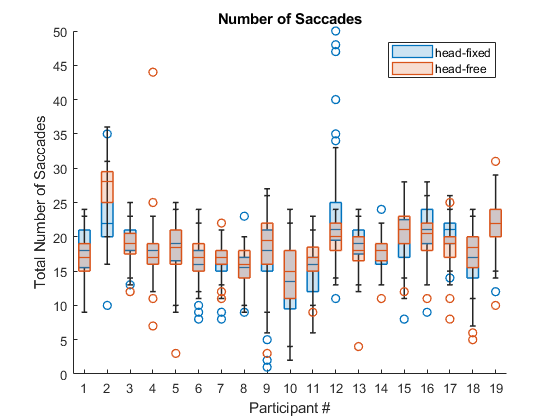
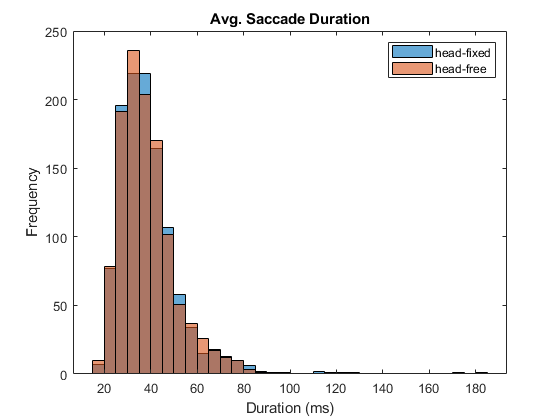
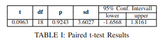

# EyeTracking_Project
Uni Konstanz Eye Tracking Theory and Practice, Data Analysis Project 

## Abstract
In the following project, we investigated whether head restraints alter saccade target selection. As part of this study, we examined a data set which included 19 different participants freely viewing 64 images from urban categories each for 6s recorded in a head fixed (1) and head free (2) condition. In the head fixed condition, participants placed their chin on a chin rest and additionally bit into a mouth guard fit for each participant. Each observer saw 64 images from a category in the head fixed and 64 in the head free condition. To measure the effect of the restraint on each individual, we computed the total number and duration of fixations and saccades using the well-known IVT algorithm. In addition, we also performed a statistical comparison of the lengths of saccades under each of the conditions mentioned above. Lastly, we used statistical techniques such as the paired sample t-test which measures two identical subjects to test whether there is any significant change in the mean difference of individual behavior. In doing so, we demonstrate that altering the following experiment conditions shows no significant effect or change on the length of saccadic eye movements.

## STATISTICAL ANALYSIS

## Preprocessing
Before performing any tests on the data which was provided to us, we first examined the data for possible noise. In many of the samples, there were random jumps or high-speed artefacts in the velocity. In fact, we discovered several examples of strange saccades which reached a critical velocity of over 1.4E8 deg/s. Although it's difficult to speculate what this error might be attributed to, it is not uncommon for eye tracking devices to track two competing cornea reflections because the individual was wearing contact lenses. This might partially explain the sudden jump in velocity in many of the samples. Nevertheless, as part of a pre-processing step, we eliminated these outliers or noise from the data as they could be perceived as saccades when in fact they most likely are not. The following diagram below shows the data after pre-processing was performed. 

After examining the data closely and doing pre-processing mentioned above, we experimented with different velocity thresholds for the I-VT algorithm. The figure above shows the measured velocity over 6 seconds for participant 1 viewing stimulus one. As is apparent in the graph, most of the saccades reach a peak velocity of approximately 300 degrees/s. The smallest saccades seem to hover around or above 50 degrees. Therefore, we decided on using a velocity threshold of 50 degrees.

To detect the saccades, we modified the implementation of I-VT which was presented in the exercise portion of the lecture to also detect saccades as well as fixations. We also extended the algorithm to gather other interesting data such as peak velocity and amplitude of the saccades. Since there was no measure of elapsed time found in the data set, we observed that for 6 seconds of data, there was approximately 3000 recorded velocities, therefore, we made the assumption that for each recorded velocity pair, a time of 2 ms had been passed.

Below shows a box plot representation of the number of saccades per participant in the study. The first thing one can notice is that the median number of saccades is dispersed around 15 to 25 per stimulus. This indicates a relatively tight spread of saccades between participants. Despite a few outliers, the difference between each participant is quite symmetrical, and shows that the data is well grouped. Lastly, the difference between the head-fixed and head-free condition is not very different which is a good first indicator that the conditions do not drastically affect the individuals behavior. For a more rigorous analysis of the effect of each condition, we will analyze the average length of each saccade in the next section.

As part of our analysis, we investigated the total number and average duration of fixations and saccades. Furthermore, we analyzed the distribution of saccadic length durations. In order to test the null hypothesis that the different experiment conditions did not in fact affect lengths of saccadic eye movements, we performed the well-known paired t-test.  As a reminder to the reader, the goal of this study can be stated as follows:

Null Hypothesis: "Different experiment conditions do not affect lengths of saccadic eye movements"

Before analyzing the length of each saccade, we first analyzed the average velocity of each participant. Next, we computed the average saccadic duration of all participants per stimulus image. Below, we can see that the average length of a saccade is around 40 ms. It should be noted that this value has been calculated assuming each recorded velocity corresponds to two ms, however, regardless of whether this assumption is accurate or not, it is clear from the data that both conditions exhibit a similar distribution. In addition to the results shown above, this is another good sign that the fixed condition has no noticeable effect on the participants eye movement behavior. In the next section, we perform the well-known paired t-test to confirm that these results are in fact statistically sound. 

## HYPOTHESIS TESTING
In order to measure whether each respective condition had any influence on the participants eye movements or more specifically, the saccadic duration, we performed a paired t-test as previously mentioned. The paired t-test is used when two dependent samples are related to each other and one would like to measure the effect that some variable has on these samples. In this study, the same participants were tested under two different conditions, namely head-free and head-fixed. Therefore, testing the null hypothesis (H_0) is simply measuring whether the mean difference between two sets of observations is zero. Since there is a possibility that the conditions could either shorten or lengthen the duration of a saccades, we performed a two-tail t-test. To reject the null hypothesis, the two-tailed alternative hypothesis (H_1) assumes that the mean difference is not equal to zero.

As part of the paired t-test, we analyzed the average length of saccades after viewing 64 images. When comparing the two conditions with each other, we found a total mean difference of 0.0796, a standard deviation of 3.6027, and a standard error of 0.8265. Typcially, statistical significance is determined by looking at the p-value where the p-value gives one an idea of the likelihood of observing the test results under the null hypothesis. In this case, our p value is quite large (i.e. 0.9243), which indicates a high probability of obtaining a result like the one that was observed when the null hypothesis is true. In addition, when looking at the confidence interval, on average one would tend to observe a difference of saccade length by approximately plus or minus 1.6 ms which is quite a small difference. As a result, this further corroborates our calculation that there is little effect produced from keeping the head restrained. 

## Summary

In summary, it is clear from our results presented above that we can not reject the null hypothesis. In addition, with a 95\% confidence interval of [-1.6568,1.8161], one can be relatively sure that the two conditions have no apparent affect on the participants saccadic length. In other words, fixing the head did not display any significant change of viewing behavior in an appreciable way in this case-study.

